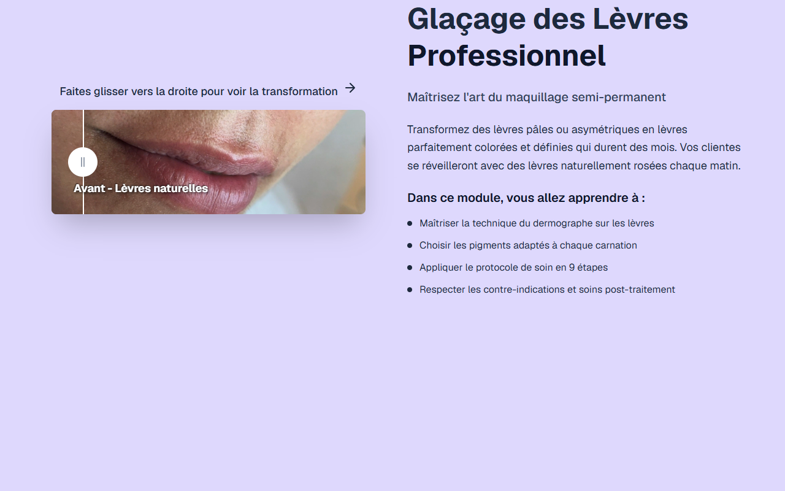

# Intro Slider — Lip Blush

**Course:** Lip Blush  
**Slide:** 1  
**Live URL:** https://lipism-6lam.edtechiecorp.com  
**Stack:** Next.js · Tailwind CSS · TypeScript · GitHub Pages  

## What this slide does

Opening intro slider for the French lip blush course, presenting the course title, a visual preview of the lip blush technique, and the key outcomes learners will achieve. The slider immediately establishes the aesthetic standard of the course and motivates learners by showing the professional results they will be able to deliver.

## Screenshot

## Usage

This slide is embedded as an iframe inside Coassemble at the live URL above. DNS is managed via Cloudflare (`edtechiecorp.com`). To update the slide, push to the `main` branch — GitHub Actions will rebuild and redeploy automatically.
